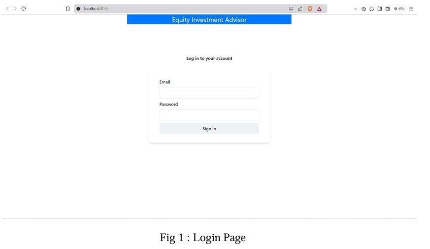
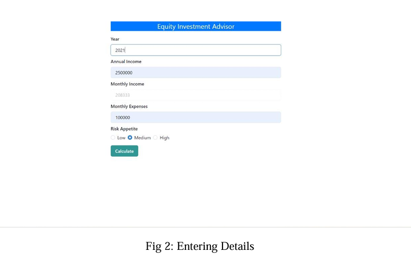
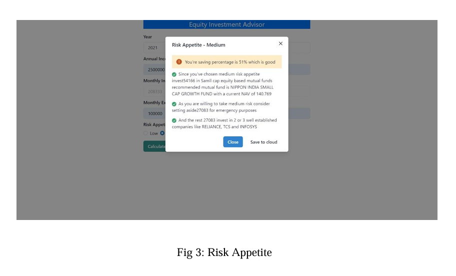
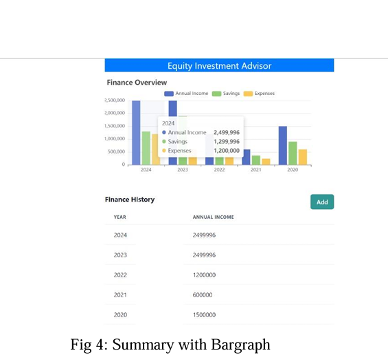
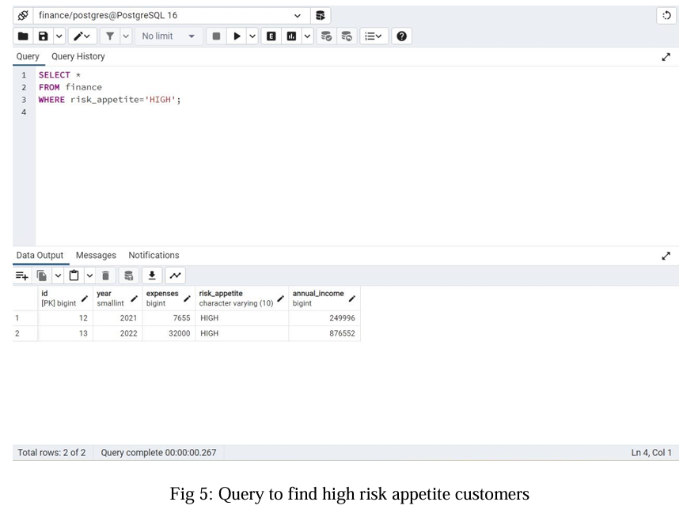
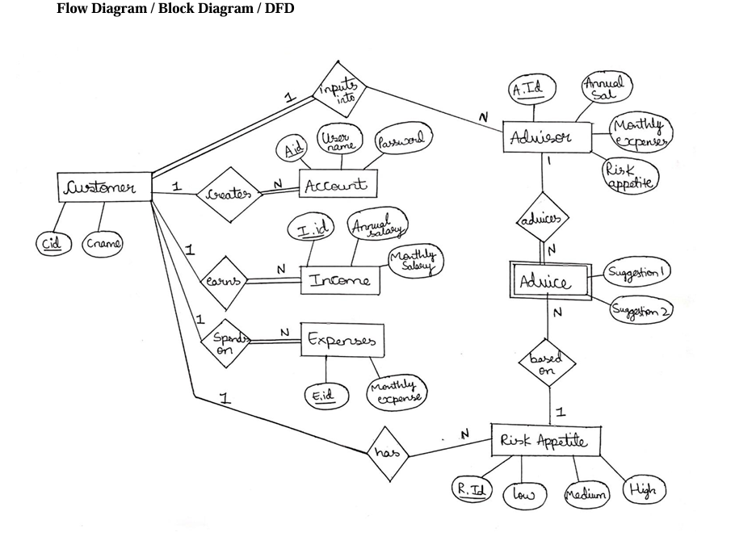

# Equity Investment Advisor

## 📄 Project Description

**Equity Investment Advisor (EIA)** is a full-stack web application designed to assist users in making informed equity investment decisions based on their financial profiles. The application analyzes users' income, expenses, and risk appetite to provide personalized investment insights. It combines a dynamic frontend interface with a robust backend and database system for real-time data analysis.

---

## 🛠️ Tech Stack Used

| Layer    | Technology          |
| -------- | ------------------- |
| Frontend | React.js            |
| Backend  | Node.js, Express.js |
| Database | PostgreSQL          |
| Tools    | pgAdmin, VS Code    |

---

## 📂 Folder Structure

```
/frontend  --> React Frontend (User Interface)
/backend   --> Node.js Backend (API, DB operations)
```

---

## 🚀 Installation & Running Guide

1. **Prerequisites**

   * Install [Node.js](https://nodejs.org/)
   * Install [PostgreSQL](https://www.postgresql.org/) and pgAdmin4
   * Ensure both are added to system **Environment Variables**

2. **Setup Project Files**

   * Unzip both `backend` and `frontend` folders in the same directory
   * Open them in **VS Code**

3. **Backend Setup**

   * Open terminal in `/backend` folder
   * Run:

     ```bash
     npm i
     npm run dev
     ```

4. **Database Setup (Using pgAdmin)**

   * Open **pgAdmin4**
   * Create a **New Server** with address: `127.0.0.1`
   * Under the server:

     * Create a **Database** named `finance`
     * Open **Query Tool** under `Schemas` and run:

       ```sql
       CREATE TABLE finance (
         id BIGSERIAL PRIMARY KEY,
         year SMALLINT UNIQUE,
         expenses BIGINT,
         risk_appetite VARCHAR(10),
         annual_income BIGINT
       );
       ```

5. **Frontend Setup**

   * Open terminal in `/frontend` folder
   * Run:

     ```bash
     npm i
     npm start
     ```
   * Access the application at `http://localhost:3000`

6. **Important Note**

   * Ensure the frontend is configured to make API requests to `http://localhost:3000/table`

---

## 🎯 Features

* User Authentication (Login Page)
* Income & Expenses Input Form
* Risk Appetite Evaluation
* Investment Summary with Graphical Representation
* Query Feature to Identify High-Risk Users

---

## ⚡ Known Limitations

* Dependent on accurate user inputs
* Algorithmic risk evaluation may not reflect personal nuances
* Generalized investment advice based on set parameters

---

## 👤 Developed By

**Aditya BG**

## 🖼️ UI Preview

| Screenshot | Description |
|------------|-------------|
|  | Login Page |
|  | Input Details |
|  | Risk Appetite Evaluation |
|  | Investment Summary with Graph |
|  | Query for High-Risk Users |
|  | Final Output Display |


## 📜 License

This project is for educational and learning purposes only. Use at your discretion.
